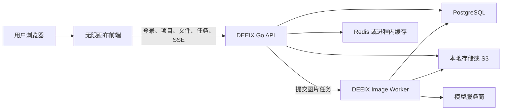

# DEEIX 后端集成开发方案

本文档描述如何保留无限画布前端，以 `DEEIX-Chat` 的 Go 服务作为业务后端。方案面向平台化部署，目标是把浏览器本地项目、浏览器直连模型和本地媒体文件，调整为账号隔离的服务端项目、统一模型路由、任务队列和文件存储。

## 1. 方案结论

两个项目不能只通过修改无限画布的 `Base URL` 直接连接。

无限画布当前调用 OpenAI、Gemini、火山方舟等上游协议，主要接口包括 `/v1/images/generations`、`/v1/images/edits`、`/v1/responses`、`/v1/videos` 和 `/v1/audio/speech`。DEEIX Chat 暴露的是 `/api/v1/*` 业务接口，包含登录鉴权、模型权限、计费、文件、任务队列和统一响应结构，不是给第三方前端直接使用的 OpenAI 兼容代理。

本方案采用以下边界：

- 无限画布负责画布交互、节点编辑、任务状态展示和结果编排。
- DEEIX Chat 负责账号、权限、模型目录、上游密钥、任务调度、计费、项目数据和媒体文件。
- 浏览器不再保存平台上游 API Key，也不再直接请求模型服务商。
- 本方案以无限画布替换 DEEIX Chat 现有简化画布页面为前提，不要求同时维护两套画布数据协议。

## 2. 当前系统差异

| 能力 | 无限画布当前实现 | DEEIX Chat 当前实现 | 集成处理 |
| --- | --- | --- | --- |
| 用户身份 | 无平台账号，用户自行配置上游密钥 | JWT Access Token、HttpOnly Refresh Cookie、用户和权限组 | 接入 DEEIX 登录态 |
| 画布项目 | Zustand + localforage | PostgreSQL 中的 `canvas_projects` | DEEIX 成为项目事实源 |
| 画布节点 | `image`、`text`、`config`、`video`、`audio`、`group` 和插件节点 | `prompt`、`image_generation`、`result` 等简化节点 | 后端场景结构调整为无限画布结构 |
| 画布连线 | `fromNodeId`、`toNodeId` | `source`、`target`、`sourcePort`、`targetPort` | 服务端直接保存无限画布连线 |
| 图片文件 | IndexedDB Blob + `storageKey` | 本地文件系统或 S3 + `file_id` | 使用 DEEIX 文件接口 |
| 图片生成 | 浏览器同步请求上游接口 | 创建 Job，由 `image-worker` 异步执行，SSE 返回状态 | 前端改为任务模式 |
| 文本生成 | 浏览器调用 Responses/Gemini 接口 | DEEIX 会话流式接口 | 增加画布文本任务适配 |
| 视频生成 | 浏览器创建并轮询上游任务 | DEEIX 会话视频流式能力 | 增加画布视频任务接口 |
| 音频生成 | 浏览器调用 `/audio/speech` | 暂无可直接替换的画布 TTS 接口 | 后续新增音频任务能力 |
| 模型配置 | 浏览器维护渠道、模型和 API Key | 管理后台维护上游、平台模型、权限和计费 | 删除前端渠道密钥配置 |

## 3. 目标架构



推荐同源部署：

- `https://app.example.com/`：DEEIX Chat 主应用。
- `https://app.example.com/canvas/`：无限画布静态资源。
- `https://app.example.com/api/v1/`：DEEIX API。

同源部署可以直接复用 Refresh Cookie，减少跨域和登录态同步问题。无限画布使用 Vite 子路径部署时，需要同步设置 Vite `base` 和 React Router 的 `basename`。

## 4. 集成范围

### 4.1 第一阶段必须完成

- DEEIX 登录态接入。
- 远程画布项目的创建、列表、读取、重命名、保存和删除。
- 图片、视频、音频等媒体文件上传和读取。
- 从 DEEIX 获取当前用户可使用的图片模型。
- 图片生成和图片编辑任务。
- 图片任务排队、执行、取消、失败和重试状态展示。
- 生成结果写回画布，并在刷新或跨设备打开后恢复。
- 模型权限、限额和计费错误的中文提示。

### 4.2 后续阶段

- 文本生成节点和图片问答。
- 视频生成节点。
- 音频/TTS 节点。
- 服务端素材库。
- 画布助手会话与 DEEIX Conversation 的关联。
- 插件 AI 能力的服务端代理。
- 断网草稿、恢复和冲突合并。

### 4.3 不在本次范围

- 让后端执行无限画布中的任意 JavaScript 模型脚本。
- 同时兼容无限画布旧的本地业务数据和新的远程数据格式。
- 将 DEEIX Chat 的管理后台并入无限画布。

## 5. DEEIX 后端改造

DEEIX Chat 已有 `backend/internal/transport/http/canvas/`、`backend/internal/application/canvas/` 和画布持久化模型，可以在现有模块上调整，不需要重新创建一套 Go 服务。

### 5.1 画布项目接口

建议形成以下接口：

| 方法 | 路径 | 用途 |
| --- | --- | --- |
| `GET` | `/api/v1/canvas/projects` | 分页获取当前用户项目 |
| `POST` | `/api/v1/canvas/projects` | 创建项目 |
| `GET` | `/api/v1/canvas/projects/:id` | 获取项目和完整场景 |
| `PATCH` | `/api/v1/canvas/projects/:id` | 修改标题、描述或状态 |
| `DELETE` | `/api/v1/canvas/projects/:id` | 删除项目 |
| `PUT` | `/api/v1/canvas/projects/:id/scene` | 按版本保存完整场景 |
| `GET` | `/api/v1/canvas/projects/:id/assets` | 获取项目关联文件 |
| `POST` | `/api/v1/canvas/projects/:id/tasks/image` | 创建图片任务 |
| `GET` | `/api/v1/canvas/projects/:id/runs/:run_id` | 获取一次画布执行状态 |
| `POST` | `/api/v1/canvas/projects/:id/runs/:run_id/nodes/:node_id/retry` | 重试失败节点 |

当前 `PATCH /scene` 使用 JSON Patch。无限画布每次更新已经可以得到完整项目状态，第一阶段建议改为保存完整场景快照，避免在前端额外实现节点、分组、批量结果和助手会话的补丁转换。请求体建议为：

```json
{
  "base_revision": 12,
  "scene_version": 1,
  "scene": {
    "nodes": [],
    "connections": [],
    "chatSessions": [],
    "activeChatId": null,
    "backgroundMode": "lines",
    "showImageInfo": false,
    "viewport": { "x": 0, "y": 0, "k": 1 }
  }
}
```

服务端使用 `base_revision` 做乐观锁。保存成功后返回新的 `scene_revision`；版本不一致时返回 HTTP `409` 和稳定错误码 `canvas_scene_revision_conflict`。

### 5.2 项目响应结构

```ts
type RemoteCanvasProject = {
  id: string;
  title: string;
  description: string;
  status: "active" | "archived";
  sceneVersion: number;
  sceneRevision: number;
  scene: RemoteCanvasScene;
  thumbnailFileId?: string;
  createdAt: string;
  updatedAt: string;
};
```

所有项目查询必须限定当前登录用户，不能接受前端传入的 `user_id`。项目、执行记录、文件和生成任务之间都通过服务端内部用户 ID 校验归属。

### 5.3 场景结构

服务端不再使用当前简化的 `prompt/image_generation/result` 节点协议，而是直接保存无限画布场景：

```ts
type RemoteCanvasScene = {
  nodes: RemoteCanvasNode[];
  connections: Array<{
    id: string;
    fromNodeId: string;
    toNodeId: string;
  }>;
  chatSessions: CanvasAssistantSession[];
  activeChatId: string | null;
  backgroundMode: "lines" | "dots" | "blank";
  showImageInfo: boolean;
  viewport: { x: number; y: number; k: number };
};
```

服务端第一阶段只验证以下内容：

- 场景 JSON 能正确解析。
- `nodes` 和 `connections` 是数组。
- 节点 ID 非空且不重复。
- 连线引用的起点和终点存在。
- 场景体积不超过配置上限。

画布布局和插件节点元数据由前端解释，后端不要为每种插件节点建立数据库表。

### 5.4 媒体字段

远程场景不能持久化 `blob:` URL 或浏览器 `storageKey`。图片、视频和音频节点改为持久化 DEEIX 文件 ID：

```ts
type RemoteMediaMetadata = {
  fileId: string;
  mimeType: string;
  bytes: number;
  naturalWidth?: number;
  naturalHeight?: number;
  durationMs?: number;
};
```

后端沿用以下文件接口：

- `POST /api/v1/files`：上传文件。
- `GET /api/v1/files/:file_id/content`：读取文件内容。
- `DELETE /api/v1/files/:file_id`：删除用户文件。

删除画布节点时不要直接删除文件。同一文件可能被项目、素材或生成任务重复引用，应由后端根据引用关系和文件保留策略清理。

### 5.5 图片任务

图片任务沿用 DEEIX 已有的 Job 和 Worker 体系。前端创建任务时发送：

```json
{
  "node_id": "config-node-id",
  "task_type": "image_generation",
  "model": "platform-model-name",
  "resolution_key": "standard",
  "aspect_ratio": "1:1",
  "output_count": 1,
  "prompt": "生成提示词",
  "negative_prompt": "",
  "options": {},
  "file_ids": [],
  "mask_file_id": "",
  "idempotency_key": "project-node-action-id"
}
```

图片编辑使用 `task_type: image_edit`，参考图放入 `file_ids`，蒙版使用 `mask_file_id`。

后端必须继续负责：

- 校验用户是否能访问所选平台模型。
- 按模型能力校验分辨率、比例、数量和可选参数。
- 生成幂等控制。
- 用户并发、全局并发和排队限制。
- 计费预留、结算和失败释放。
- 上游路由、熔断和重试。
- 输出写入文件存储并生成 `file_id`。

任务创建后立即返回 `job.id` 和 `run_id`。前端通过以下接口获取状态：

- `GET /api/v1/image/jobs/:id/stream`：单任务 SSE。
- `GET /api/v1/image/jobs/stream`：用户任务汇总 SSE。
- `GET /api/v1/image/jobs/:id`：断线后的状态校准。
- `POST /api/v1/image/jobs/:id/cancel`：取消任务。

终态输出使用 Job 的 `outputs[].file_id`。前端把文件 ID 写入结果节点并保存场景。

配置节点还需保存 `jobId`、`runId` 和 `idempotencyKey`。用户关闭页面后重新进入时，前端可以继续查询任务并补回结果，避免任务成功但画布没有结果节点。

### 5.6 文本、视频和音频

第一阶段不要让这些能力绕过 DEEIX 继续直连上游。

建议逐步增加：

| 能力 | 建议接口 | 后端复用 |
| --- | --- | --- |
| 文本节点 | `POST /api/v1/canvas/projects/:id/tasks/text/stream` | DEEIX 文本模型路由和流式事件 |
| 图片问答 | 同文本任务，附带 `file_ids` | 文件权限、视觉模型和会话执行器 |
| 视频节点 | `POST /api/v1/canvas/projects/:id/tasks/video` | DEEIX 视频生成适配器和计费 |
| 音频节点 | `POST /api/v1/canvas/projects/:id/tasks/audio` | 新增 TTS 适配、任务和计费能力 |

画布任务接口应返回适合画布节点消费的统一事件，不要求无限画布解析 DEEIX Chat 页面使用的全部 Conversation 事件。

### 5.7 模型目录

无限画布不再维护渠道、Base URL 和 API Key。模型选择改为读取：

- `GET /api/v1/models`：当前用户可用文本等平台模型。
- `GET /api/v1/image/models`：当前用户可用图片模型及能力配置。
- `GET /api/v1/image/configuration`：图片配置开关。

前端控件必须使用后端返回的模型能力生成选项，不再通过模型名称关键词猜测图片、视频或音频能力。

## 6. 无限画布前端改造

### 6.1 API 客户端

在 `web/src/services/api/` 下增加 DEEIX 请求封装，统一处理：

- API Base URL。
- `Authorization: Bearer <accessToken>`。
- `credentials: include`。
- DEEIX `{ errorMsg, errorCode, details, requestId, data }` 响应。
- 401 后刷新 Access Token。
- SSE 解析和 AbortSignal。
- 429、409、余额不足、权限不足和任务容量不足等错误。

组件不得自行拼接 DEEIX URL 或读取 Token。

### 6.2 登录态

平台版本进入业务页面前必须完成登录检查：

1. 页面启动时调用 Refresh 接口恢复会话。
2. 获取 Access Token 后请求 `/api/v1/me`。
3. 未登录时进入登录页或跳转到 DEEIX Chat 登录页。
4. Access Token 只保存在内存状态中。
5. Refresh Token 继续使用 HttpOnly Cookie，不写入 localStorage 或 localforage。

如果无限画布与 DEEIX API 不同源，需要在 DEEIX `cors_allow_origin` 中加入画布 Origin，并正确配置 Cookie 的 Domain、Secure 和 SameSite。生产环境优先使用同源部署。

### 6.3 画布 Store

`web/src/stores/canvas/use-canvas-store.ts` 调整为远程状态缓存：

- `loadProjects()`：从服务端加载项目列表。
- `loadProject(id)`：读取场景和 `sceneRevision`。
- `createProject()`：服务端创建完成后再进入项目。
- `renameProject()`：调用项目更新接口。
- `deleteProjects()`：逐个或批量调用服务端删除接口。
- `saveProject()`：防抖保存完整场景。

项目编辑仍然先更新 Zustand，保证拖拽和输入即时响应；网络保存异步执行。Store 需要公开 `saving`、`saved`、`saveError` 和 `conflict` 状态供顶部状态区展示。

建议保存策略：

- 节点拖拽、输入和视口变化后防抖 500～1000ms。
- 同一项目同一时刻只允许一个保存请求。
- 保存进行中产生的新修改在本次完成后再次保存。
- HTTP 409 时停止覆盖，重新读取服务端项目并提示冲突。
- 页面关闭前若仍有修改，使用普通离开提示，不依赖异步请求一定完成。

### 6.4 文件服务

替换 `image-storage.ts` 和 `file-storage.ts` 的业务持久化职责：

- 本地选择文件后调用 `POST /api/v1/files`。
- 节点只保存 `fileId` 和媒体元信息。
- 展示时通过带鉴权的 Fetch 获取 Blob，再创建临时 Object URL。
- Object URL 只存在内存中，节点卸载或项目切换时执行 `URL.revokeObjectURL`。
- 引用图、蒙版、视频和音频生成都传 `file_id`，不再传 base64 或 `blob:` URL。

可以保留一个内存级 `fileId -> objectUrl` 缓存，避免同一画布重复下载同一文件。

### 6.5 生成服务

以下现有调用需要替换：

- `requestGeneration()` → 创建 DEEIX 图片任务。
- `requestEdit()` → 上传引用文件后创建 DEEIX 图片编辑任务。
- `requestImageQuestion()` → 后续画布文本任务接口。
- `requestVideoGeneration()` → 后续画布视频任务接口。
- `requestAudioGeneration()` → 后续画布音频任务接口。

图片任务前端流程：

1. 组装提示词和上游引用节点。
2. 确保所有引用媒体已经取得 DEEIX `fileId`。
3. 创建图片任务。
4. 把配置节点更新为 `loading`，记录 `jobId` 和 `runId`。
5. 订阅任务 SSE。
6. 收到成功状态后读取 `outputs[].file_id`。
7. 创建一个或多个结果节点。
8. 保存远程场景。
9. 收到失败或取消状态时记录稳定错误码和中文错误信息。

### 6.6 配置页面

平台版本移除或隐藏以下配置：

- 渠道 Base URL。
- 上游 API Key。
- OpenAI/Gemini/火山方舟协议选择。
- 浏览器执行的模型自定义请求脚本。
- 通过 `/v1/models` 直接读取上游模型。

保留用户偏好，例如默认画布背景、默认输出数量、主题和提示词来源。模型默认值应保存平台模型标识，不保存上游真实模型名称。

## 7. 鉴权与安全

- 浏览器不得获得 DEEIX 保存的上游 API Key。
- Access Token 不持久化到 localStorage、IndexedDB 或导出文件。
- Refresh Token 只使用 HttpOnly、Secure Cookie。
- 所有项目、文件、Job 和 Run 接口都按当前用户校验归属。
- 文件内容接口需要鉴权；不能把内部存储路径直接返回前端。
- 服务端限制场景 JSON 大小、单用户项目数量和保存频率。
- `options` 中只允许模型能力声明的字段，不能把任意字段原样转发给上游。
- 浏览器自定义 JavaScript 请求脚本不得迁移到服务端执行。
- 日志记录 `requestId`、用户、任务和错误码，不记录 Token、API Key、完整 Prompt 或文件内容。

## 8. 部署改造

DEEIX Chat 继续运行：

- Go API 进程。
- PostgreSQL。
- Redis 或进程内缓存。
- 图片 Worker，且同一队列只运行预期数量的 Worker。
- 本地文件卷或 S3 对象存储。

无限画布通过 Vite 构建为静态资源，由 Nginx、Caddy 或 DEEIX 前置反向代理托管。推荐由网关负责：

```text
/canvas/*  -> 无限画布静态文件
/api/*     -> DEEIX Go API
/*         -> DEEIX Chat 前端
```

无限画布不能直接覆盖 DEEIX 配置的 `frontend_dist_dir`，否则会替换整个 DEEIX Chat 前端。应由反向代理分别托管两个静态应用，或者明确决定只保留无限画布一个前端。

## 9. 开发阶段

### 阶段一：接口基础

- 明确同源部署路径。
- 接入登录、刷新和当前用户接口。
- 完成 DEEIX API 客户端与错误处理。
- 后端调整无限画布场景结构和项目 CRUD。
- 前端完成远程项目列表、打开和保存。

验收标准：两个账号只能看到自己的项目；刷新、重新登录和另一台设备打开后画布结构一致。

### 阶段二：文件与图片生成

- 替换本地媒体持久化。
- 接入图片模型目录。
- 接入图片生成、编辑、SSE、取消和重试。
- 处理页面关闭后的任务恢复。
- 接入额度、权限、并发和队列错误。

验收标准：参考图、蒙版和生成结果均以 `file_id` 保存；服务重启和页面刷新后仍能恢复；前端不再请求模型服务商域名。

### 阶段三：其他生成能力

- 增加画布文本任务接口。
- 增加画布视频任务接口。
- 增加音频/TTS 任务体系。
- 调整插件 AI Host，统一调用 DEEIX。

验收标准：文本、视频和音频节点均走当前用户模型权限、计费和审计，不再从浏览器直连上游。

### 阶段四：平台完善

- 服务端素材库和画布资源引用。
- 缩略图和项目搜索。
- 离线草稿和冲突处理。
- 监控、审计、任务指标和容量告警。

## 10. 测试清单

### 项目与并发

- 新建、重命名、删除和导入项目。
- 多标签页同时编辑时触发 revision 冲突，不静默覆盖。
- 两个用户使用相同项目 ID 时不能越权访问。
- 大场景超过限制时返回稳定错误，不导致服务内存异常。

### 文件

- 上传图片、视频、音频和蒙版。
- 无权访问其他用户文件。
- 项目刷新后媒体正常恢复。
- 同一文件被多个节点引用时删除一个节点不会误删文件。
- S3 和本地存储返回行为一致。

### 图片任务

- 文生图、参考图编辑、蒙版编辑和多图输出。
- 排队、运行、成功、失败、取消和重试状态。
- 页面刷新、断网重连和 SSE 断线后通过 Job 查询恢复。
- 同一个幂等键不会重复扣费或创建重复任务。
- 模型无权限、余额不足、并发超限和上游失败提示正确。

### 安全

- 浏览器网络记录和导出配置中没有上游 API Key。
- Access Token 失效后可以刷新，刷新失败后回到登录页。
- CORS 只允许配置的站点。
- 场景内容、Prompt 和媒体内容不进入普通访问日志。

## 11. 开源边界

无限画布前端继续按 AGPL-3.0 提供对应源码和许可证说明。DEEIX 后端如果是独立实现、只通过 HTTP/SSE 接口与前端通信，并且不复制或链接无限画布代码，通常可以维持独立许可证或闭源授权策略。

前后端分离不会解除无限画布前端本身的 AGPL 义务。准备闭源商业部署前，应再根据最终打包、分发和部署方式进行法律审核。

## 12. 关键代码位置

无限画布仓库：

- `web/src/stores/canvas/use-canvas-store.ts`：画布项目状态和本地持久化。
- `web/src/services/image-storage.ts`：本地图片 Blob。
- `web/src/services/file-storage.ts`：本地视频和音频 Blob。
- `web/src/services/api/image.ts`：图片和文本直连接口。
- `web/src/services/api/video.ts`：视频直连接口。
- `web/src/services/api/audio.ts`：音频直连接口。
- `web/src/stores/use-config-store.ts`：渠道、模型和 API Key。
- `web/src/pages/canvas/project.tsx`：画布保存和生成流程。

DEEIX Chat 仓库：

- `backend/internal/transport/http/server.go`：API、鉴权和模块注册。
- `backend/internal/transport/http/canvas/`：画布 HTTP 接口。
- `backend/internal/application/canvas/`：画布业务逻辑。
- `backend/internal/transport/http/image/`：图片任务和 SSE。
- `backend/internal/application/image/`：图片任务、模型和执行逻辑。
- `backend/internal/worker/`：后台 Worker。
- `backend/internal/transport/http/conversation/`：会话、文件和视频接口。
- `frontend/shared/api/`：DEEIX 自身前端的接口契约参考。
